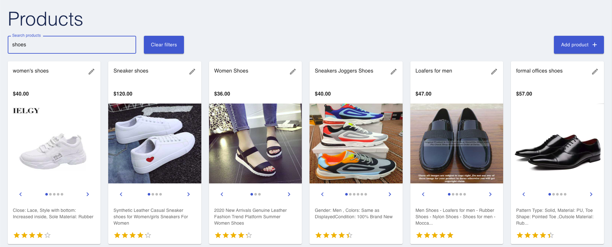
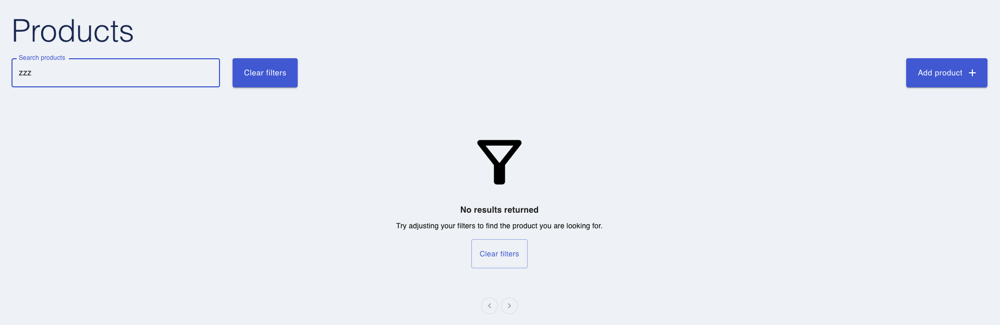
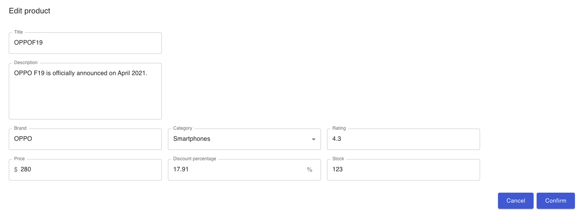
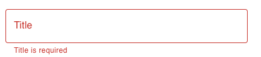

# Permaconn coding challenge

There are some deprecated functions and untested versions being used, but I did nto have time to look into resolving

## Application set up from root
To run the application change into the root directory and run the following commands

```javascript
npm install
npm run start
```

## Running the apps individually

From the root directory run the following commands

### Server set up

```javascript
cd server
npm install
npm run start
```

### Client set up
```javascript
cd client
npm install
npm run start
```

## Testing
Testing can be performed from the root directory, client or server with the following command.

```javascript
npm run test
```

**`Note`** - the directory you run the tests from will impact which tests are run. (Root runs all, client runs client etc)

## Application notes

### Landing page
Users should arrive at the homepage on application start up


### Search

- Users can perform search via the input in the left hand corner of the applications
- Results will be filtered and returned accordingly





#### Clearing filters

- Can be done via the 'Clear filters' button located next to search field
- Alternatively users can clear the input manually


### Creating and editing

- To add a new product users can click the 'Add product' button found on the right hand side of the screen


- To edit an existing users can click the 'Edit' button found at the top of each product card


User should be presented with the create/ edit dialog



Some basic validation will be performed before the request is submitted


